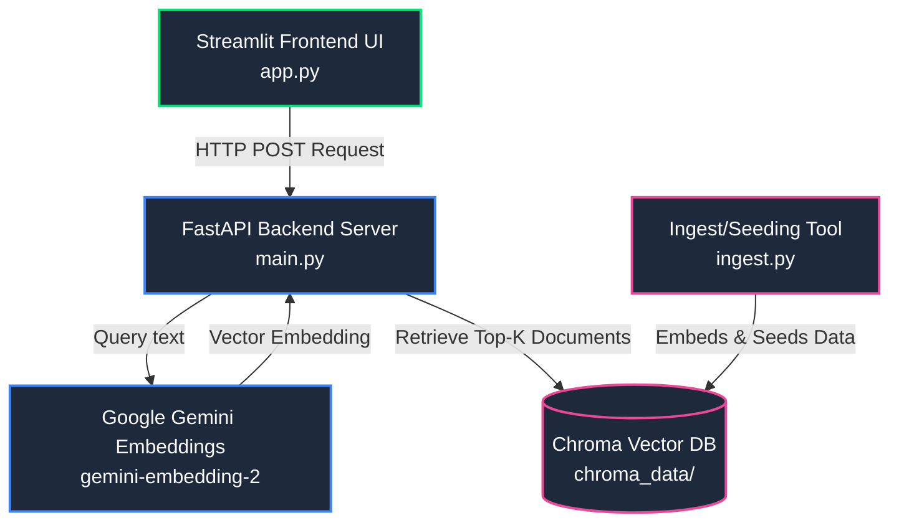

# 🛡️ secOwasp — Secure Semantic Intelligence for OWASP Top 10

secOwasp is a production-grade, context-aware Retrieval-Augmented Generation (RAG) semantic database search application. It utilizes modern AI embeddings to search, analyze, and retrieve security guidance, remediation models, and code examples for OWASP Top 10 vulnerabilities.

---

## 🏛️ Architecture & System Design



---

## ✨ Features

- **Semantic Search Engine**: Finds relevant OWASP vulnerabilities and mitigations based on conceptual meaning, not just exact keyword matches.
- **Modern Google GenAI Embedding Integration**: Custom embedding wrapper built on `google-genai` using the high-performance `gemini-embedding-2` model.
- **FastAPI Core Backend**: Secure, production-safe endpoints with robust lifespan events, structured JSON-friendly log prints, and rigorous Pydantic v2 input guards (mitigating resource exhaustion/DoS).
- **Streamlit Interactive UI**: Cyber-defensive theme featuring rich animations, custom glassmorphism panels, confidence levels, and active status validation.

---

## 📁 Repository Structure

```tree
.
├── .env                  # Project secrets (API keys)
├── .env.example          # Sample environment configuration template
├── .gitignore            # Version control exclusions
├── app.py                # Streamlit premium chatbot frontend
├── database.py           # Database helper utility & schema documentation
├── ingest.py             # Script to initialize/seed vector collections
├── main.py               # Production FastAPI backend application
└── requirements.txt      # Python dependencies
```

---

## 🚀 Setup Instructions

### 1. Prerequisites
- Python 3.10 to 3.12 active environment.
- A valid Google Gemini API Key. Get one from [Google AI Studio](https://aistudio.google.com/).

### 2. Environment Configuration
Clone or navigate to the workspace, create your virtual environment and install dependencies:

```bash
# Create virtual environment
python -m venv .venv

# Activate virtual environment
# On Windows (PowerShell):
.venv\Scripts\Activate.ps1
# On macOS/Linux:
source .venv/bin/activate

# Install required packages
pip install -r requirements.txt
```

### 3. Configure API Key
Create a `.env` file based on `.env.example` in the project root:

```ini
GEMINI_API_KEY="your-gemini-api-key-here"
```

---

## 💾 Core Workflows

### Step 1: Database Initialization & Seeding
Populate the Chroma DB vector collection with standard OWASP documents and codes by running `ingest.py`:

```bash
python ingest.py
```
This initializes the vector store under `./chroma_data/` and seeds initial records utilizing Gemini Embeddings.

### Step 2: Start the FastAPI Backend
Start the server using `uvicorn`:

```bash
uvicorn main:app --host 127.0.0.1 --port 8000 --reload
```
You can access the backend documentation at:
- Swagger UI docs: http://127.0.0.1:8000/docs
- Health status check: http://127.0.0.1:8000/health

### Step 3: Launch Streamlit Web UI
In a separate terminal workspace, load the reactive chatbot UI:

```bash
streamlit run app.py
```
The app will open automatically in your browser at `http://localhost:8501`.

---

## 🎨 Interactive Controls & UI Design

- **Status Monitor**: The UI proactively pings `/health` to display whether the backend indexing system is online.
- **Safety Overrides**: If the backend is dead/unavailable, UI queries are disabled to prevent crashing.
- **Clear Conversation**: Destroys the active chat logs from the current session cache safely.
- **Confidence Rating**: Visualizes the document distance matching score as a intuitive percentage statistic.
